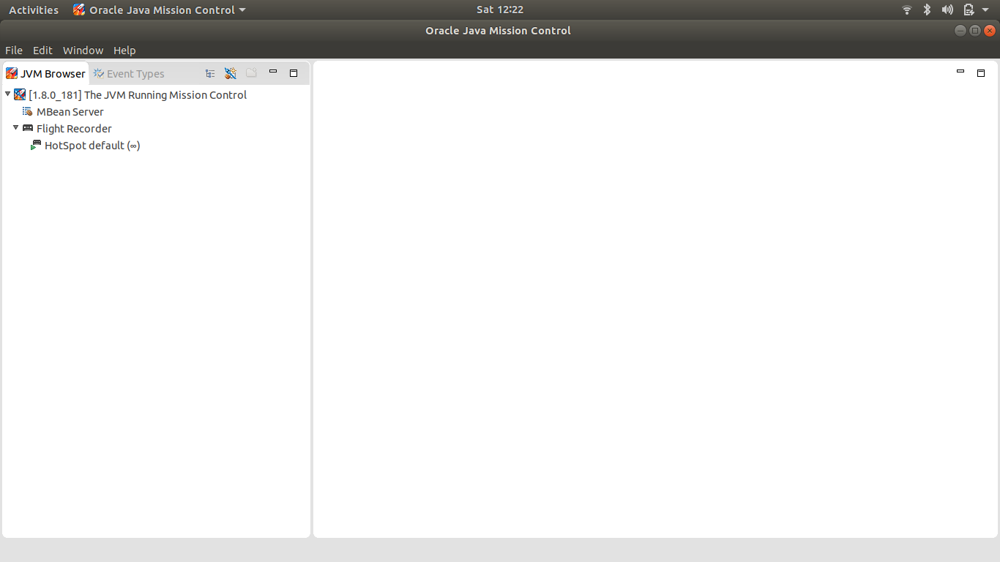
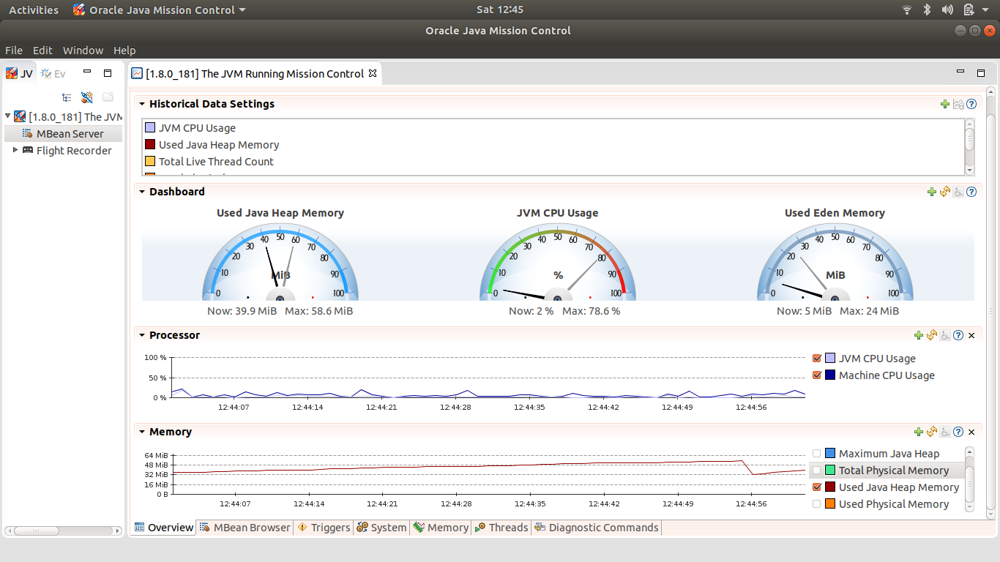
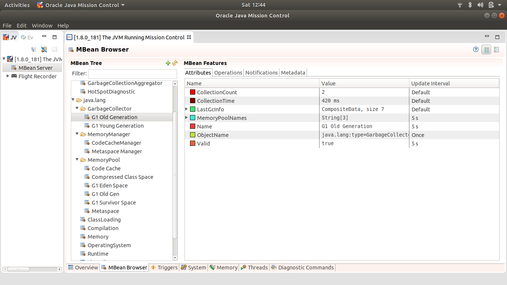
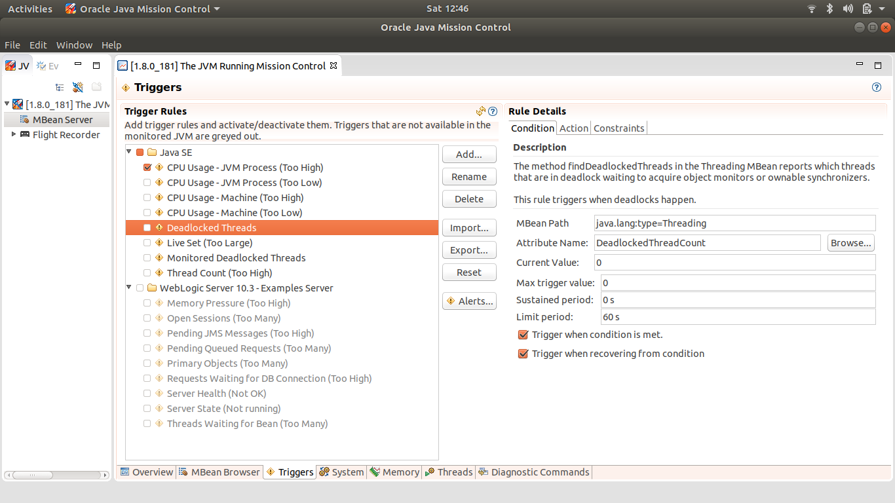
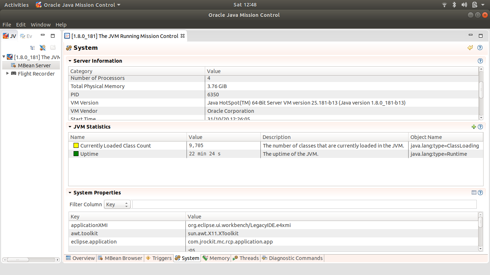
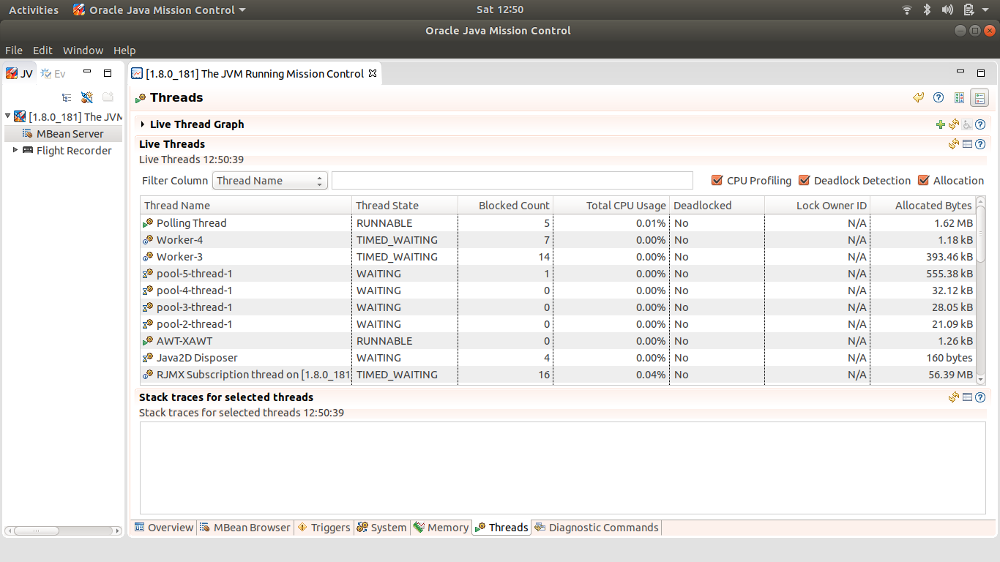
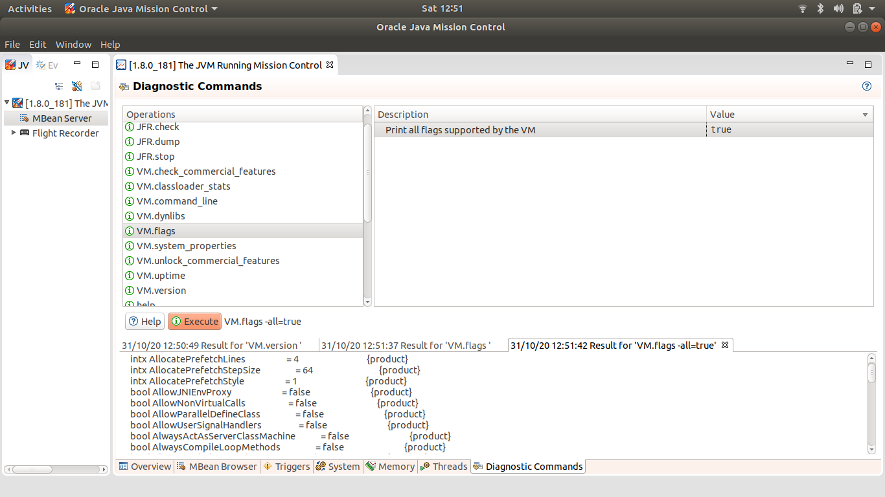

# JAVA MISSION CONTROL (JMC)
* JMC - Build for monitoring, profiling and troubleshooting java applications
* It Consists of 
  * 1. `JMX Console` : For monitoring JVM and application in real time
  2. `Java Flight Recorder`: For collecting data about JVM and appliction.
  3. Optional tools via plug-ins (e.g. heap dump analysis, DTrace recording)

* `/usr/lib/jvm/java-8-oracle/bin/jmc`
  
  

### Mission Control Features

#### Application Features
* A framework for hosting various useful java tools
* A tool for visualizing the contents of java flight recordings, and the results of an automated analysis of the contents
* A JMX Console
* A tool for heap waste analysis

#### Core API Features
* Core APIs for parsing and processing Java flight recordings
* Core API can read recordings from JDK 7 and above
* Core API can run on JDK 8 and above
* Core API contains a framework for handling units of measurement and physical qunatities
* Core API supports headless analysis of Java flight recordings

## Java Management Extensions (JMX)
* The Java virtual machine (Java VM) has built-in instrumentation that enables you to monitor and manage it using the Java Management Extensions (JMX) technology. These built-in management utilities are often referred to as out-of-the-box management tools for the Java VM. You can also monitor any appropriately instrumented applications using the JMX API.

* MBean Server Overview : Shows customizable graphs/metrics of whole application
  

* MBean Browser : Shows Management Bean property information and features of MBean

* MBean Triggers : Triggers/alerts to configure based on threshold of specific metrics
  

* MBean System : Shows all informatio of system properties and metrics
  

* MBean Memory : Shows all information about memory (Heap/Non-Heap) metrics including GC metrics

* MBean Threads : Shows all information about threads of an applications and their state information
  

* Diagnostic Commands : Shows Virtual machine arguements, we can set dynamically set or invoke them

### References
* https://www.oracle.com/java/technologies/jdk-mission-control.html
* https://github.com/openjdk/jmc
* https://openjdk.java.net/projects/jmc/
* https://docs.oracle.com/javase/8/docs/technotes/guides/management/agent.html