# Things to consider
  - Stop the world events (Whole application will pause while collection happening)
  - Memory Fragmentation
  - Througput (How fast the gc getting completed)

# Basic Ideas
    - Has a 'Young Generation' and an 'Old Generation'
    - Most Initial Objects allocated in 'Eden Space'
    - Young Generation also has two 'Survivor Spaces'
    - Objects that survive a GC get moved to the survivor space
    - Only one survivor space in use at a time
    - Objects copied between survivor spaces
    - Old generation is where long lived objects(after multiple gc's) go to die
    - Permanent Generation is `META-SPACE` where class loading, static context and string constant pool's will be there... No Garbage Collection will take's place
    
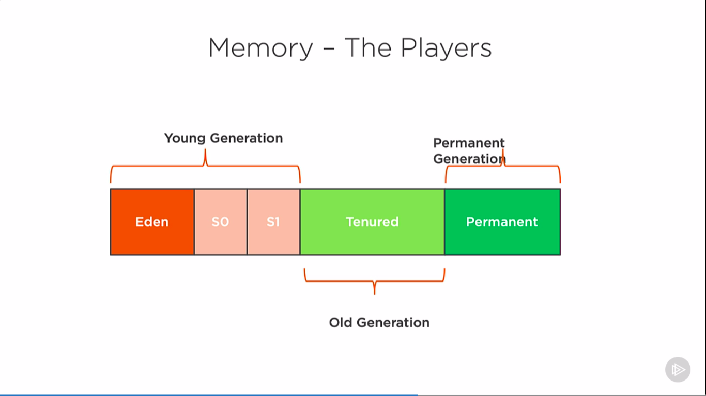

# Young Generation

*   Most Objects live for a very short time
    *   The 'turtle' theory of garbage collection
    *   i.e. you die young or live 'forever'

# Minor Garbage Collection

*   Objects will start allocating into Eden Space
  
    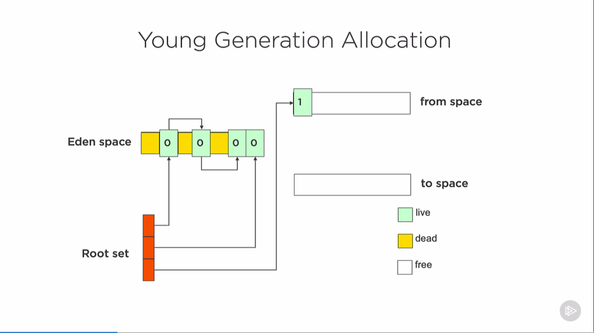

    *  When GC runs, live objects are copied to 'newer' survivor space

    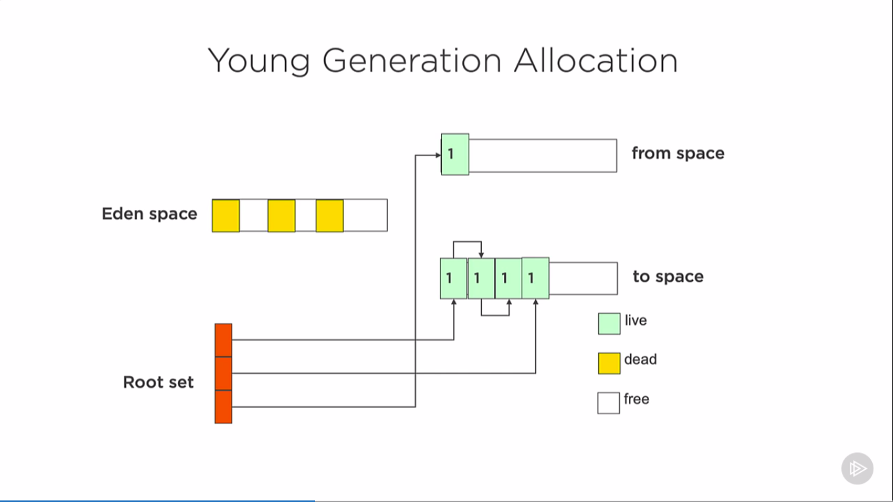

    *  Objects from 'older' survivor space also copied to 'newer' survivor space
    
    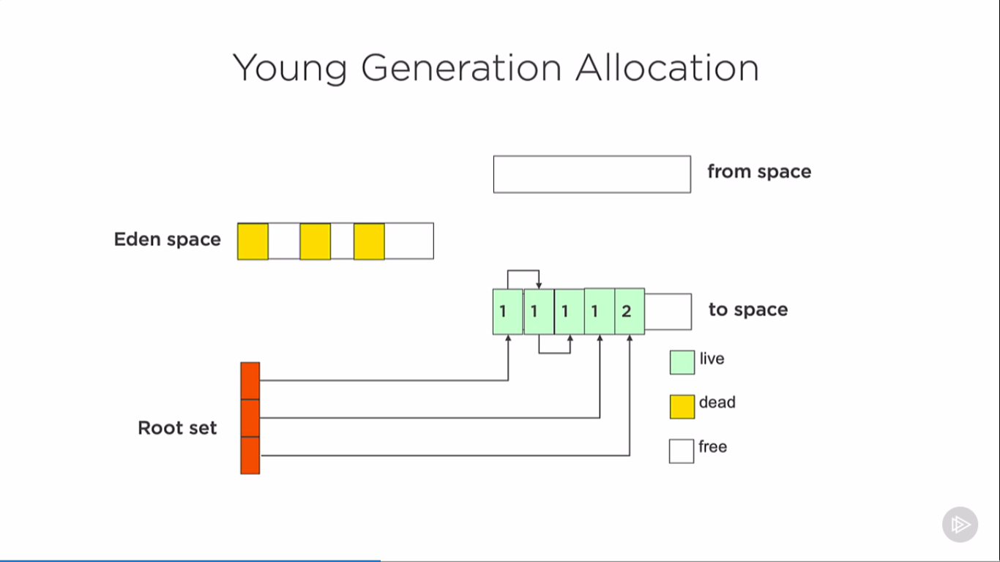
    
    *  Survivor spaces are swapped
    *  New objects allocated into Eden

    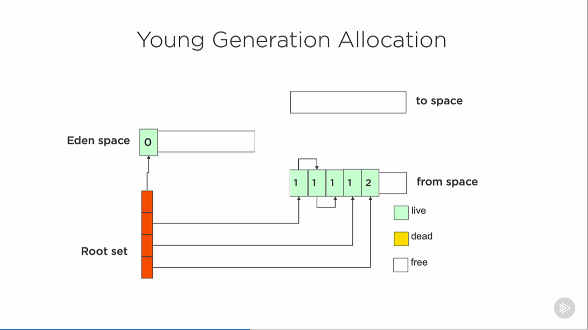

    ### Note: Numbers in the images represents number of garbage collections

# Major Garbage Collection

*   Triggered when the tenured/old space is full
    *   Collects old and young generations
    *   Although this is really a 'Full GC'
  
## Copying to Old Generation

* JVM will eventually promote live objects to old generation
  * After a certain number of garbage collects
  * If survivor space is full
  * If JVM has been told to alwasy create objects in old space
  
  **` java -XX:+AlwasyTenure ` flag to JVM**

    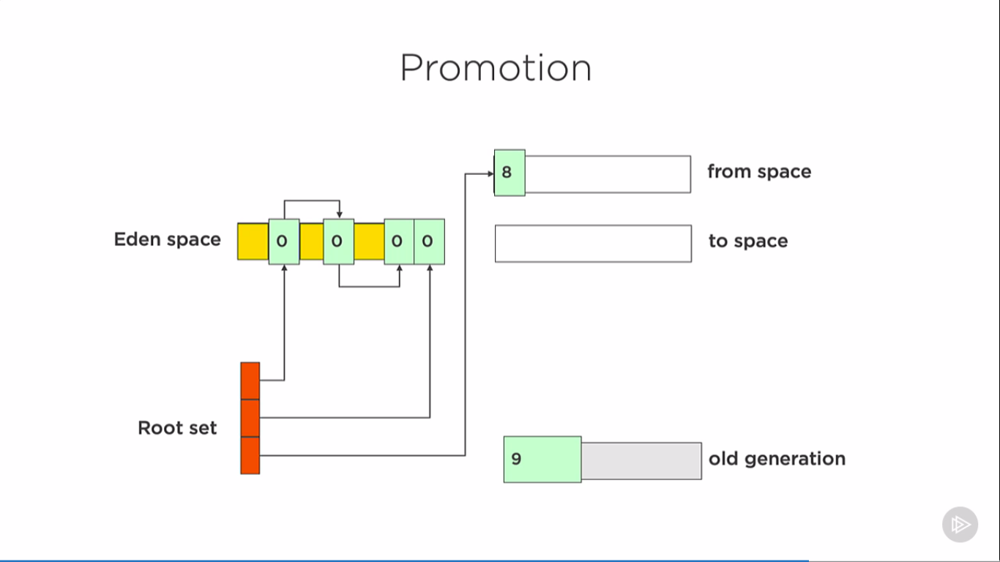  

    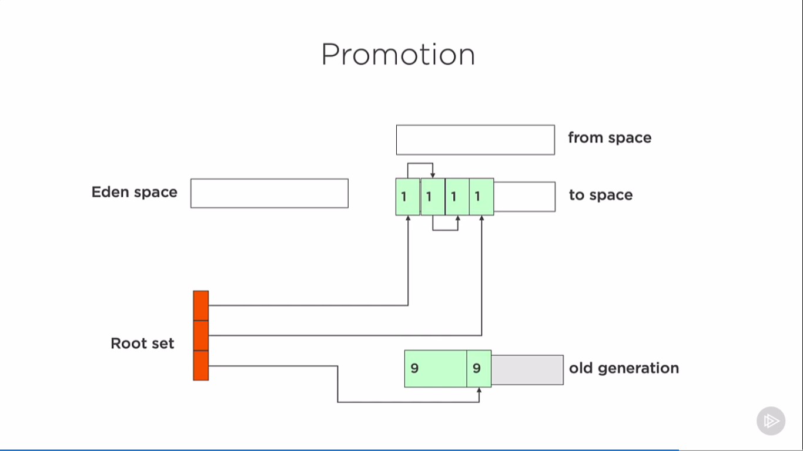  

### Allocating Objects to Old Space

*   Objects over a certain size will be allocated directly in old space
    *   No JVM option to force objects to old space
    *   Option ** `java -XX:PretenureSizeThreshold=<n>`**
    *   All objects larger than <n> bytes should be allocated directly in old space
    *   However if object size fits TLAB, JVM will allocate it in TLAB (Thread Local Allocation Buffer)

# Memory Allocation

*   Want memory allocation to be as quick as possible
    *   Can simply increment a pointer
    *   Young always uses this, old may use it
    *   However, have to be aware of multi-threading issues
    *   Java use Thread Local Allocation Buffers (TLABS)
    *   Each thread gets it's own buffer in the Eden space
    *   No locking required

# What Does Live Mean ?

* Live Roots :
  * From Stack frames (Root Set)
  * Static Variables (Metaspace/permanent Gen)
  * Others such as JNI (Java Native Interface) and synchronization 'monitors'
  * References from live rooted objects are followed to other objects

### What about references from old Generation to Young ?

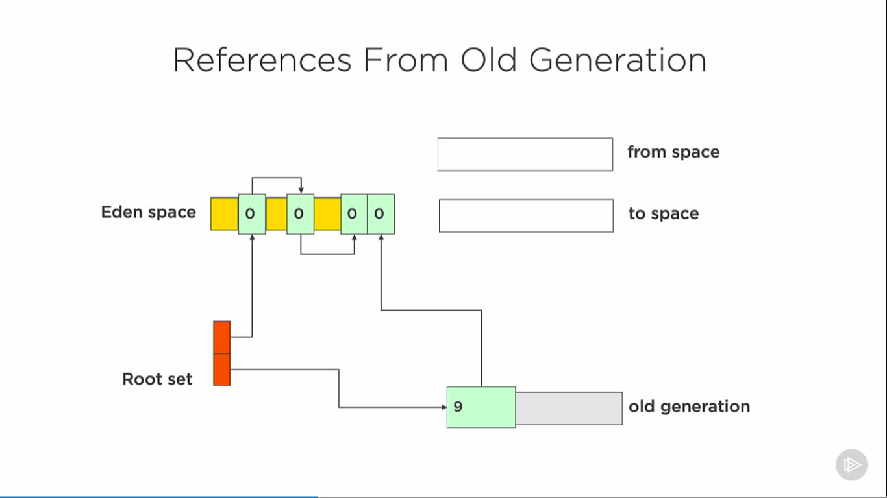  

*   This is an issue -> Young GC has to scan 'old' space
*   Sort of defeats the purpose
*   Introduced **CardTable**
  
# CardTable

* Each write to a reference to a young object from old space goes through a write barrier
* This write barrier updates a card table entry
* One entry per 512 bytes of memory
* Minor GC scans CardTable looking for the areas that contain references instead of looking whole old space
* Load that memory and follow the reference

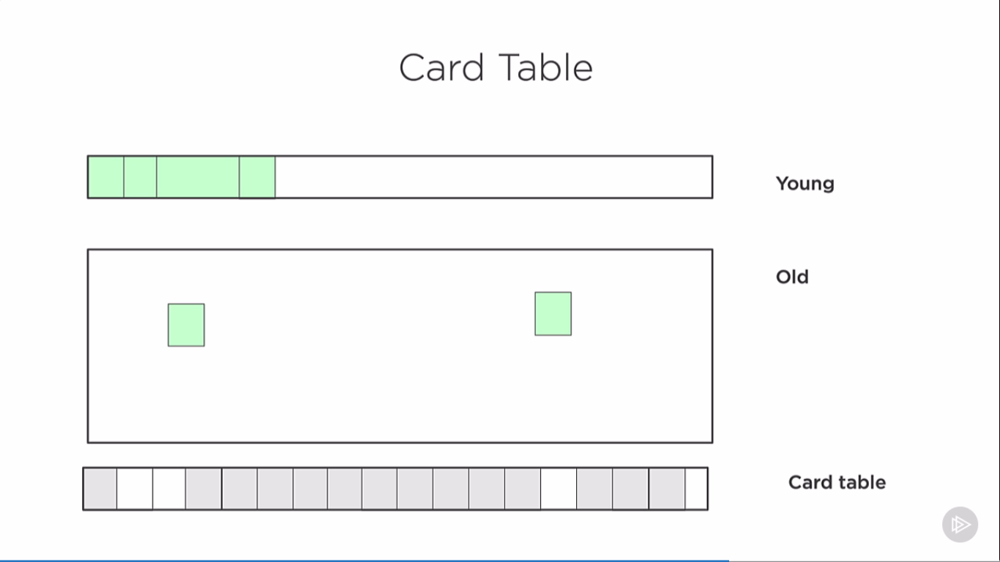  

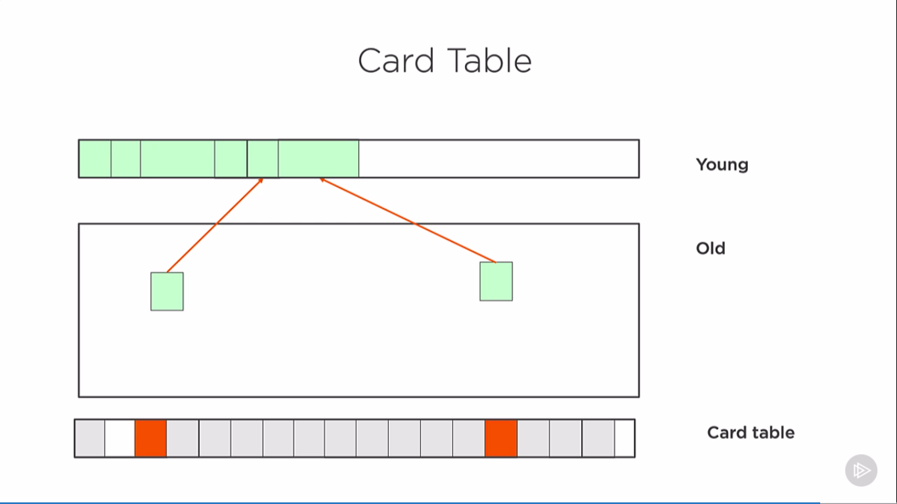  

# Different Garbage Collectors

* Serial Generational Collector `java -XX:+UseSerialGC`
* Parallel for young space, serial for old space generational collector ` java -XX:+UseParallelGC`
* Parallel young and old space generatinal collector ` java -XX:+UseParallelOldGC`
* Concurrent mark sweep with serial young space collector ` java -XX:+UseConcMarkSweepGC`  
` java -XX:-UseParNewGC`
* Concurrent mark sweep with parallel young space collector `java -XX:+UseConcMarkSweepGC`

# Serial Collector
*   Single Threaded (Stop the world i.e. pause the app)
*   Mark and sweep
*   OK for small applications running on the client

# Parallel Collector
* Multiple Threads for minor collection
* Single thread for major collection
* Same process as Serial
* Use on servers
  
# Parallel Old Collector
*   Multiple threads for minor and major collections
*   Preferred over ParallelGC

# Concurrent Mark And Sweep

*   Deprecated from JAVA-9
*   Only Collects old space
*   No longer 'bump the pointer'
*   Causes Heap Fragmentation
*   Designed to be lower latency
    ## Concurrent Mark Sweep Details
    * Initial Mark Phase (Stop the world): 
        * Mark Objects in the old generation reachable from the root references
    * Concurrent mark Phase (Concurrent):
        * Traverse object graph looking for the live objects, any allocations made during this phase are automatically marked as live (use write barrier)
    * Remark Phase (Stop the world) :
        * Finds objects created after the previous phase stopped
    * Concurrent Sweep Phase (Concurrent) : 
        * Collects objects
    * Resetting Phase (Concurrent) :
        * Get ready for the next run

# G1 Collector
*   New in Java 6
    *   Officially supported in Java 7
    *   Is a compacting collector
    *   Planned as a replacement for CMS
        *   Default 'server' collector in Java 11
    * Meant for server applications
      * Running on multiprocessor machines with large memories
    * Breaks heap into regions
      * Still has concept of Eden, Survivor and Tenured (Old) spaces and similarly

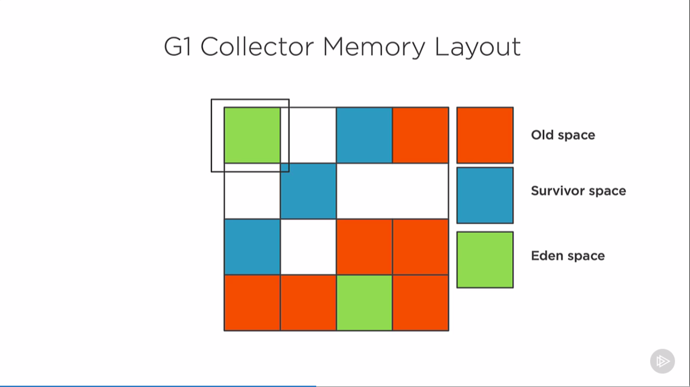  

*   Objects are 'evacuated'
    *   Moved/Copied between regions

# Which Collector Should use ?

*   No Easy answer to this question
*   Java offers a mixture of garbage collectors From Serial to G1
*   Picking a collector is not a simple job
*   Profile the application under as close to production load as possible
*   Test under the different garbage collectors

# References
*   https://docs.oracle.com/en/java/javase/11/gctuning/index.html
*   https://www.oracle.com/technetwork/tutorials/tutorials-1876574.html