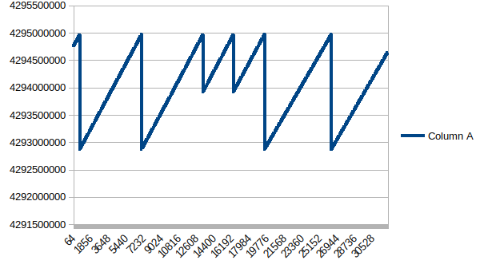

# Demo on How Garbage Collection works

* Populate large Objects in Heap and see the memory allocations

    `javac JVM_GARBAGE_COLLECTORS/Garbage_Collection_Demo/Sawtooth.java`
     

    `java -Xmx5m JVM_GARBAGE_COLLECTORS.Garbage_Collection_Demo.Sawtooth > output.csv`

    * output.csv contains memory address of objects that are allocated during app running  

    