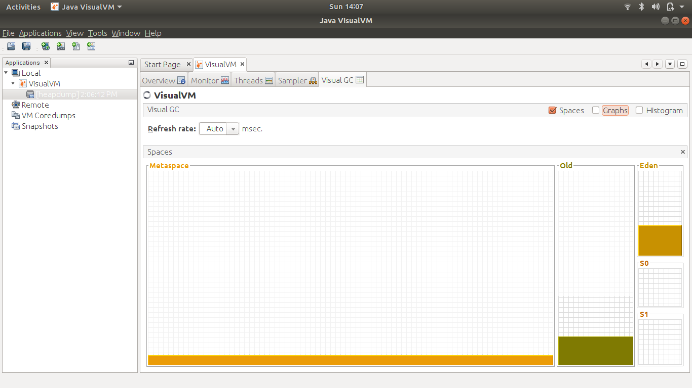

# Tools to monitor JVM Garbage Collector
*   MXBeans
*   Monitoring GC
    *   Jstat
    *   VisualVM and Visual GC
  
# MXBeans

*   Running on Java - 11
    *   `javac GCMXBean.java`
    *   `java GCMXBean`
  
    ```
    Name : G1 Young Generation
    Number of Collections : 0
    Collection Time : 0 ms
    Pool Names : 
        G1 Eden Space   G1 Survivor Space       G1 Old Gen
    Name : G1 Old Generation
    Number of Collections : 0
    Collection Time : 0 ms
    Pool Names : 
        G1 Eden Space   G1 Survivor Space       G1 Old Gen
    ```

    * `java -XX:+UseConcMarkSweepGC GCMXBean`
    
    ```
    Java HotSpot(TM) 64-Bit Server VM warning: Option UseConcMarkSweepGC was deprecated in version 9.0 and will likely be removed in a future release.
    
    Name : ParNew
    Number of Collections : 0
    Collection Time : 0 ms
    Pool Names : 
        Par Eden Space  Par Survivor Space
    Name : ConcurrentMarkSweep
    Number of Collections : 0
    Collection Time : 0 ms
    Pool Names : 
        Par Eden Space  Par Survivor Space      CMS Old Gen **
    ```

# JSTAT

### Command line tool provided with the JVM to monitor GC locally as well remotely

** `jstat -option <java-pid> <interval> <count>`**

```
> javac AllocationOverwrite.java
> java AllocationOverwrite

> jstat -gcutil 11020
> jstat -gccapacity 11020
> jstat -gccause 11020

```

# NOTE : KEEP IN MIND THAT MEMORY ALLOCATION'S WILL ALSO PLAY BIG ROLE. WE DO HAVE POINTER BASED ALLOCATION'S IN OLD GC'S WHERE AS IN G1GC WE DO HAVE FRAGMENTATIONS. CHOOSE APPROPRIATLEY.

#### Reference : https://docs.oracle.com/en/java/javase/15/docs/specs/man/jstat.html

# VisualVM
* Provided as part of the JDK, also download it as a separate tool 
  * [text](https://visualvm.github.io/)
* Open VisualVm and attach java process for it to view/monitor space allocations as well garbage collection details
  
  

  

  

  

  

  

  