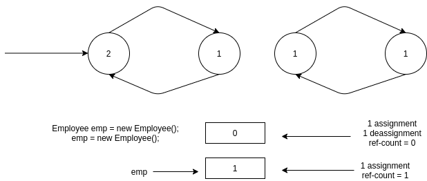
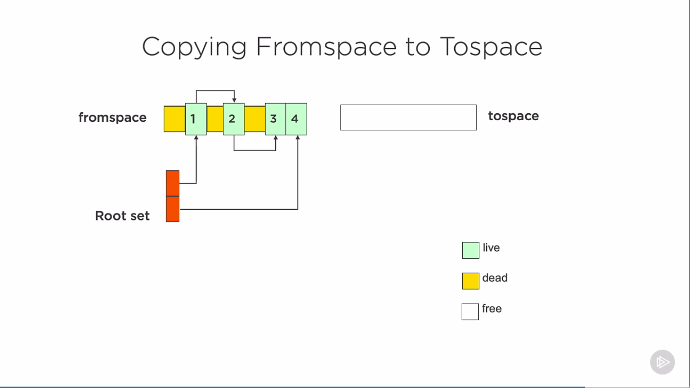
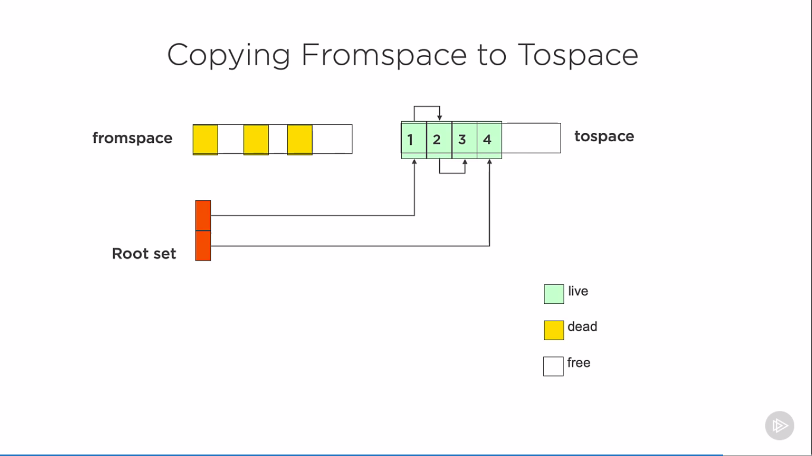

# Agenda
    * Understanding JVM Memory Management
    * Understanding Various aspects of Garbage Collection
        * How GC Works
        * Interaction With Garbage Collection
## Why GC ?
   * To Avoid Memory Leaks
   * create and forget: No need to remember to delete
     ` Employee emp = new Employee`
   * use and forget : no need to ask "Should i delete" (neither provider nor receiver)
      ` Employee emp = getEmployee()`
   * use with confidence: Objects will not vanish or become corrupt behind your back
      ` emp.incSalary(amount)`
   
   * Garbage collector promises that it will never claim live objects but no promises about dead objects

    
   
# Note:
    * Used Java-11 for Demo's
    * Things changed in Java 7
      * G1 garbage collector introduced
    * Things changed in Java 9
      * CMS garbage collector deprecated
      * Finalizers deprecated
      * Cleaner introduced

# Types of Garbage Collector's
    * Do Nothing
    * Reference Counting
    * Mark and Sweep
    * Copying
    * Generational
    * Incremental

# Refernce Counting Garbage Collector:
   
   

    ## Onus on client to call methods when allocating/freeing memory
      * COM for example had AddRef and Release calls for objects
      * When count hit's zero, object can be freed
      * Problems with circular references

# Mark And Sweep Garbage Collector:

  * Mark Phase that identifies the objects that are still in use (Rootset -> Stack (Per Thread))
    
    
  * Sweep Phase to remove unused objects
    
    

  * Compact Phase to compact the memory (Physical memory will change internally)
  
    

# Copying Garbage Collector:

  * Uses different spaces to manage memory
  
    * Allocates memory in `fromspace` and may follow mark&sweep to identify dead objects
  
    

    * Copy all the live objects from `fromspace to Tospace`

    

    * Remove Dead objects from fromspace and allocate objects in freed-fromspace

    